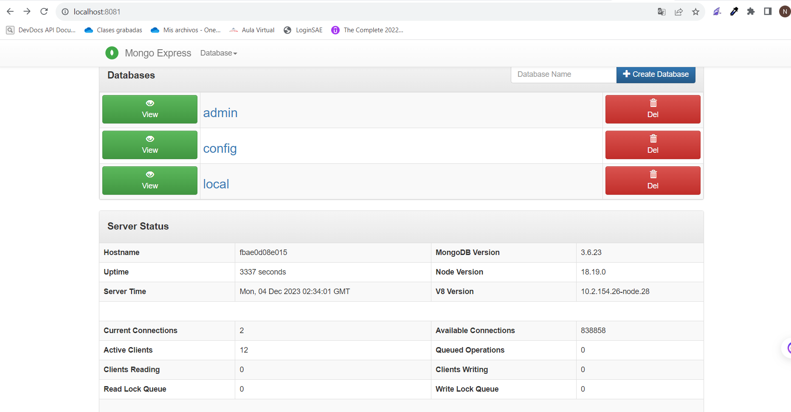
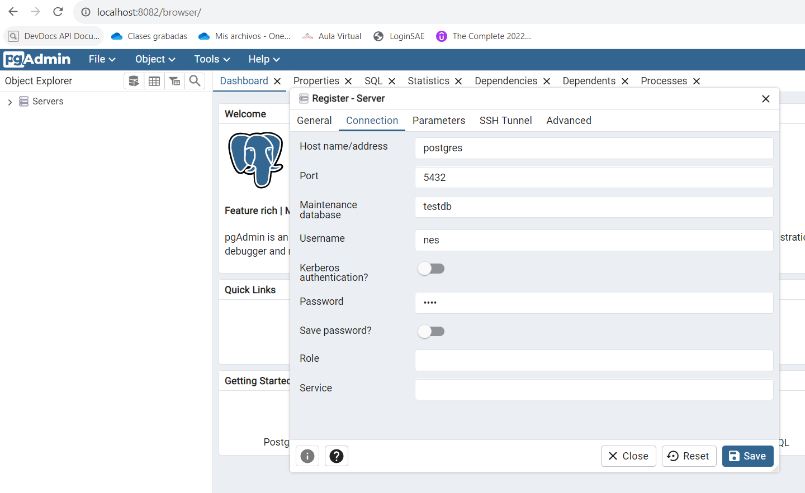

# tarea-5

El archivo markdown que contiene la resolución de la tarea es [tarea 5](tarea-5.md)

- Crear contenedor de mongo sin que exponga sus puertos usar la imagen: mongo:3.6.23 y crear un cliente de mongo: mongo-express

- Crear contenedor de postgres sin que exponga sus puertos con la imagen: postgres:11.21-alpine3.17 y crear un cliente dpage/pgadmin4

