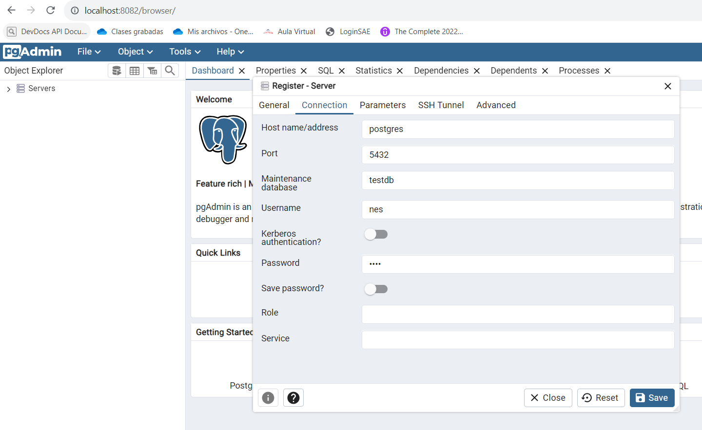

Nombre: Nardy Cachipuendo  
Materia: Construcción y evolución de software

### Crear contenedor de mongo sin que exponga sus puertos usar la imagen: mongo:3.6.23 y crear un cliente de mongo: mongo-express. Analizar qué variables de entorno son necesarias.

- Crear la red mongo-network  

```bash
    docker network create mongo-network  
```

- Previamente, se crean los archivos denominados "[var-mongo.txt](var-mongo.txt)" y "[var-mongo-express.txt](var-mongo-express.txt)" que contienen las variables de entorno para mongoDB y el cliente de mongo respectivamente.   
    1.  Las variables de entorno necesarias para la creación del contenedor de **mongo** son:
        - *MONGO_INITDB_ROOT_USERNAME* y *MONGO_INITDB_ROOT_PASSWORD*: estas variables usadas en conjunto crean un nuevo usuario y coniguran una contraseña.
    2. Las variables de entorno necesarias para **mongo-express** son:
        - *ME_CONFIG_MONGODB_ADMINUSERNAME*: Especifica el nombre de usuario del administrador de MongoDB. En este caso, es root.
        - *ME_CONFIG_MONGODB_ADMINPASSWORD*: Especifica la contraseña del administrador de MongoDB. 
        - *ME_CONFIG_MONGODB_SERVER*: Especifica el nombre del servidor de MongoDB al que se debe conectar Mongo Express. En este caso, es mongo, que es el nombre del contenedor de MongoDB en la misma red.
        - *ME_CONFIG_BASICAUTH_USERNAME* y *ME_CONFIG_BASICAUTH_PASSWORD* se utilizan para proteger el acceso a la interfaz de usuario de Mongo Express.


- Crear contenedor mongo

```bash
    docker run --name mongo -d --env-file var-mongo.txt --network mongo-network mongo:3.6.23
```

- Crear cliente mongo-express

```bash
    docker run --name mongo-express -d -p 8081:8081 --env-file var-mongo-express.txt --network mongo-network mongo-express
```
- Se evidencia el acceso al cliente en el localhost después de ingresar al credenciales configuradas.


### Crear contenedor de postgres con la imagen: postgres:11.21-alpine3.17 y crear un cliente dpage/pgadmin4. Analizar qué variables de entorno son necesarias.

- Crear la red 

```bash
    docker network create postgres-network
```
- Previamente, se crean los archivos denominados "[var-postgres.txt](var-postgres.txt)" y "[var-pgadmin.txt](var-pgadmin.txt)" que contienen las variables de entorno para postgres y el cliente de pgadmin respectivamente.   

    1.  Las variables de entorno necesarias para la creación del contenedor de **postgres** son *POSTGRES_PASSWORD*, *POSTGRES_USER* y *POSTGRES_DB* se utilizan para establecer la contraseña, el nombre de usuario y la base de datos predeterminada de PostgreSQL.
    2. Las variables de entorno necesarias para **pgadmin** son *PGADMIN_DEFAULT_EMAIL* y *PGADMIN_DEFAULT_PASSWORD* se utilizan para configurar el correo electrónico y la contraseña predeterminados de pgAdmin. Estos serán los credenciales que utilizarás para iniciar sesión en la interfaz web de pgAdmin.
- Crear contenedor postgres 

```bash
    docker run --name postgres -d --env-file var-postgres.txt --network postgres-network postgres:11.21-alpine3.17
```

- Crear cliente pgadmin

```bash
    docker run --name pgadmin -d -p 8082:80 --env-file var-pgadmin.txt --network postgres-network dpage/pgadmin4
```

- Se evidencia el acceso al cliente en el localhost.


- Se muestra como conectarse a PostgreSQL desde pgAdmin en el localhost.




